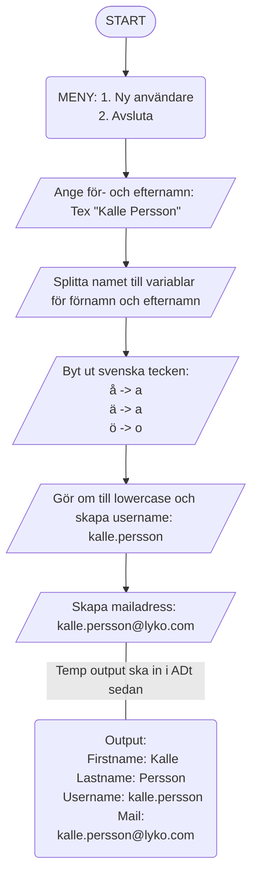

```mermaid
flowchart TD
    START([START])
    MENU(MENY: 1. Ny användare 
    2. Avsluta)
    INPUT[/Ange för- och efternamn: Tex "Kalle Persson"/]
    NAMESPLIT[/Splitta namet till variablar för förnamn och efternamn/]
    SWEDISH[/Byt ut svenska tecken: 
    å -> a 
    ä -> a 
    ö -> o/]
    USERNAME[/Gör om till lowercase och skapa username: kalle.persson/]
    EMAIL[/Skapa mailadress: kalle.persson@lyko.com/]
    OUTPUT(Output:
    Firstname: Kalle
    Lastname: Persson 
    Username: kalle.persson
    Mail: kalle.persson@lyko.com)

    START --> MENU
    MENU --> INPUT
    INPUT --> NAMESPLIT
    NAMESPLIT --> SWEDISH
    SWEDISH --> USERNAME
    USERNAME --> EMAIL
    EMAIL-- Temp output ska in i ADt sedan ---OUTPUT
```