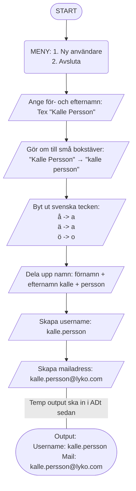

```mermaid
flowchart TD
    START([START])
    MENU(MENY: 1. Ny användare 
    2. Avsluta)
    INPUT[/Ange för- och efternamn: Tex "Kalle Persson"/]
    LOWERCASE[/Gör om till små bokstäver: "Kalle Persson" → "kalle persson"/]
    SWEDISH[/Byt ut svenska tecken: 
    å -> a 
    ä -> a 
    ö -> o/]
    SPLIT[/Dela upp namn: förnamn + efternamn kalle + persson/]
    USERNAME[/Skapa username: kalle.persson/]
    EMAIL[/Skapa mailadress: kalle.persson@lyko.com/]
    OUTPUT([Output: 
    Username: kalle.persson
    Mail: kalle.persson@lyko.com])

    START --> MENU
    MENU --> INPUT
    INPUT --> LOWERCASE
    LOWERCASE --> SWEDISH
    SWEDISH --> SPLIT
    SPLIT --> USERNAME
    USERNAME --> EMAIL
    EMAIL-- Temp output ska in i ADt sedan ---OUTPUT
```